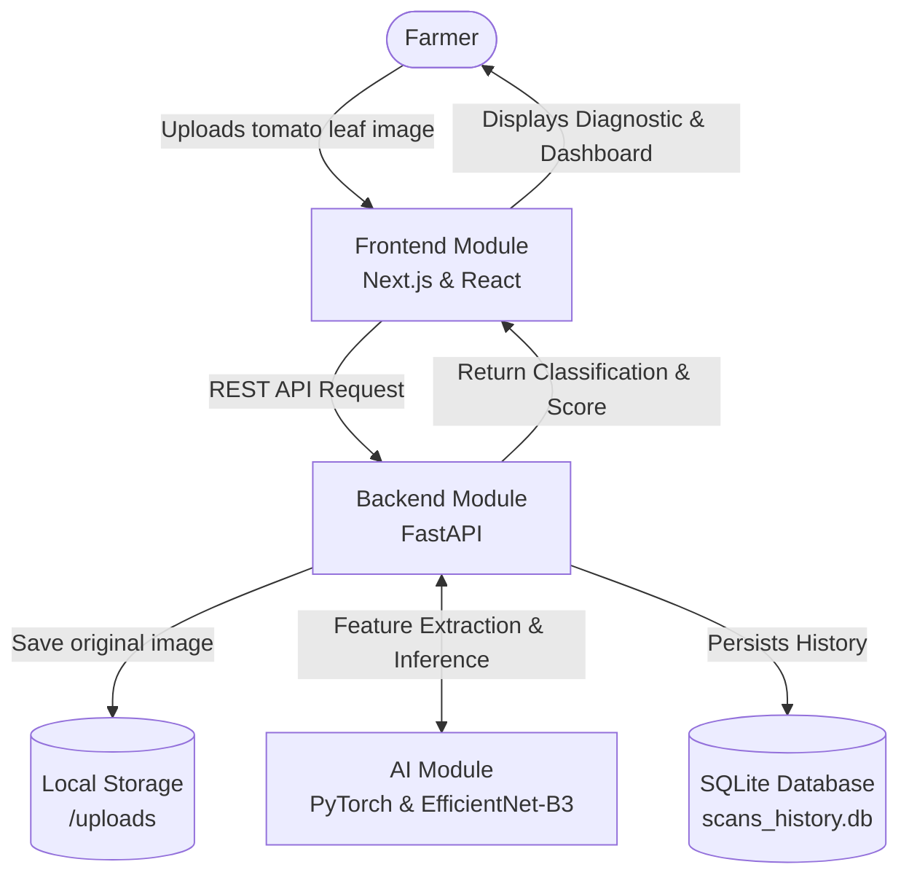
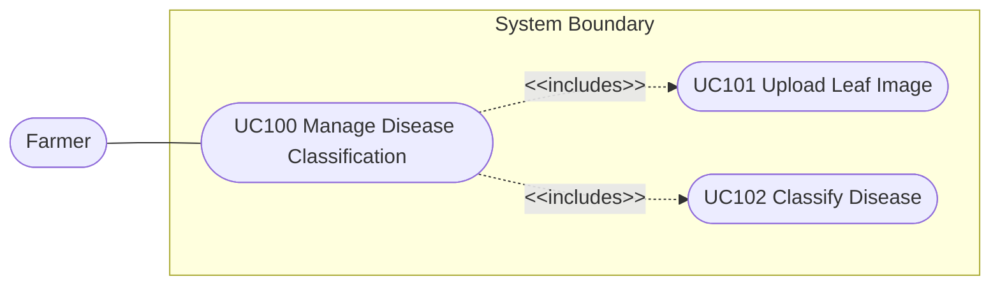
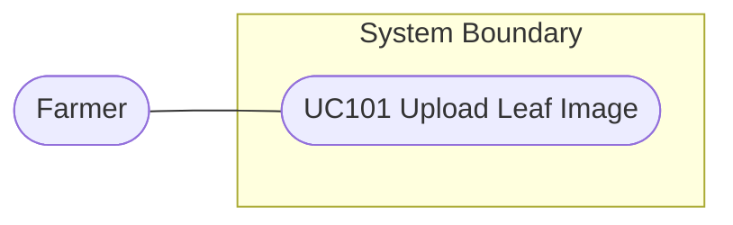
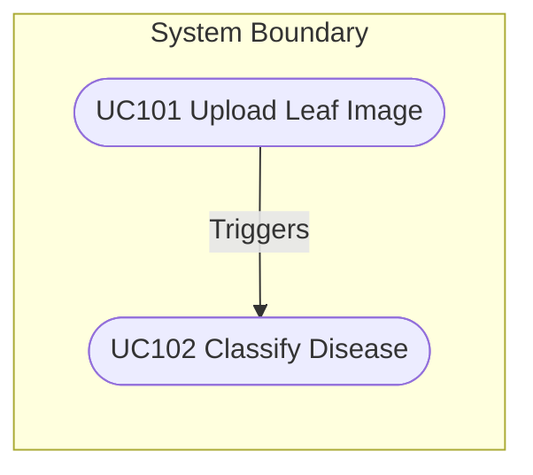
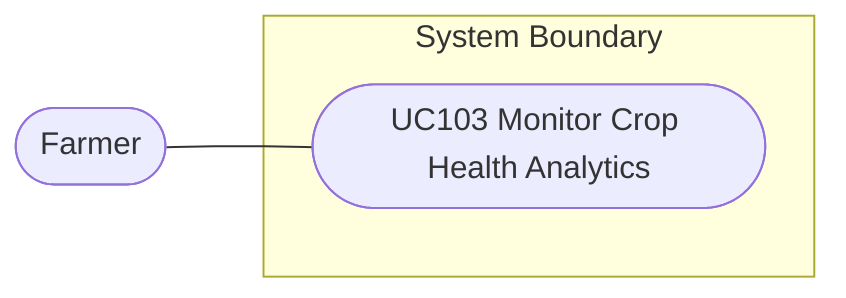
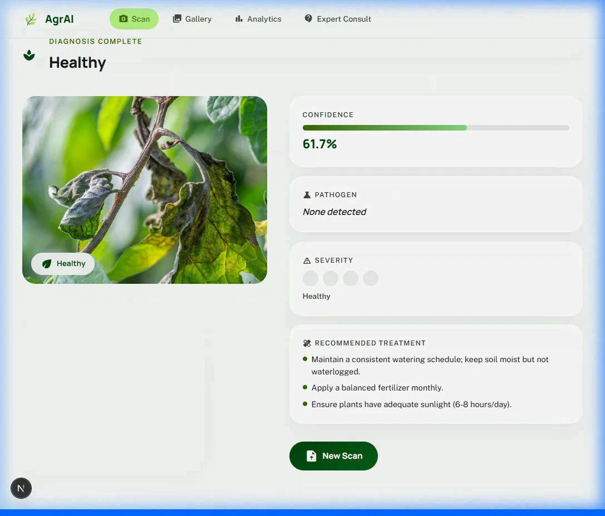
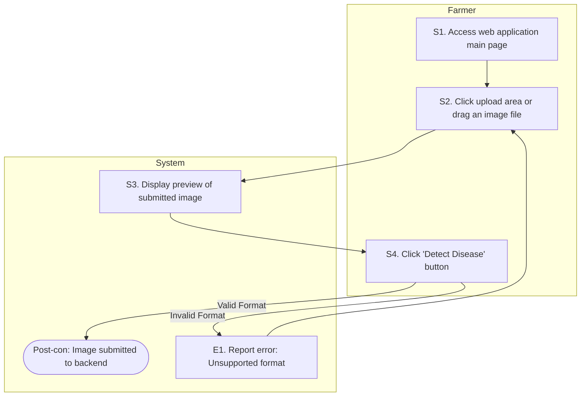
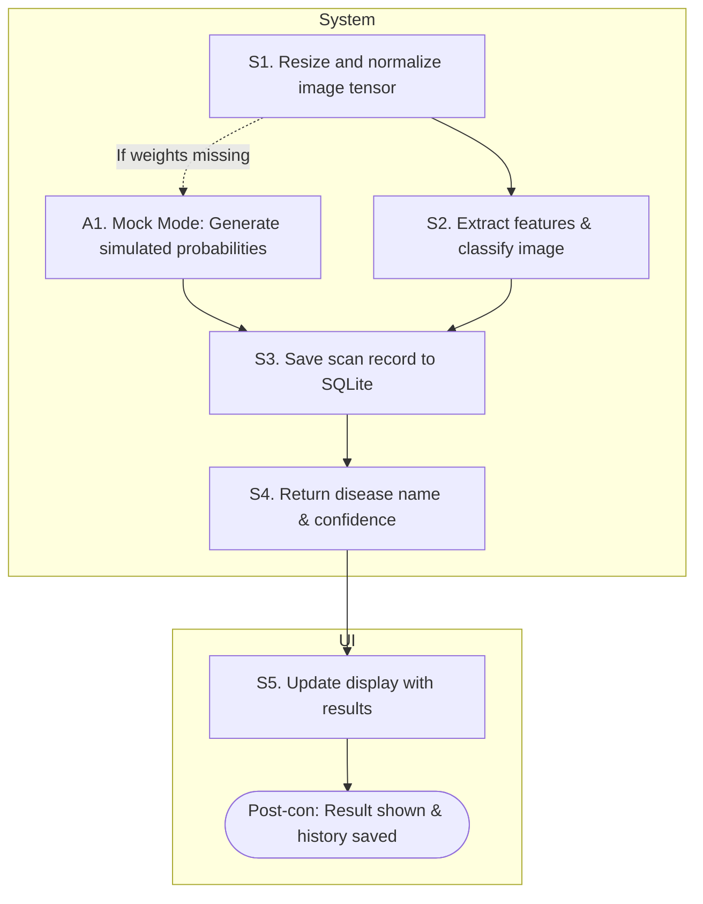
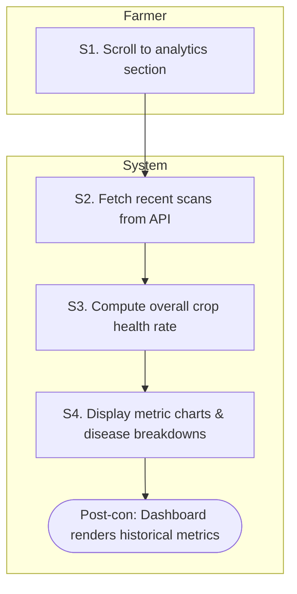

# Software Requirement Specification

**for Smart Tomato Disease Classification System**

**Version:** 1.0 approved
**Prepared by:**
- นายเจตนิพัทธ์ ทองเชื่อ (AI Engineer)
- นางสาวสิมิลันนา พาล์เมียรี่ ชไวเกิร์ต (AI Engineer)
- นายปีติภัทร ยอดทองดี (Software Engineer)
- นางสาวณัฐกานต์ ดาวช่วย (Project Manager)

**College of Computing**
**Prince of Songkla University, Phuket Campus**
**Date Created:** 18 February 2026 

---

## Preface
This Software Requirements Specification (SRS) aims to outline the requirements and specifications for the Smart Tomato Disease Classification System. It is intended for the stakeholders of the project, including agricultural users (farmers/specialists) and the software/AI development team (AI Engineers, Software Engineers, and Project Managers). This document serves as the foundation for the system's architecture, design, and subsequent development phases.

### Revision History
| Version | Date | Description | Name |
|---|---|---|---|
| V 1.0 | 13 February 2026 | Initiate the first version of SRS | Peetiphat Yodthongdee |
| V 1.1 | 19 April 2026 | Restructured Use Cases, refined Functional Requirement tables, and embedded Live UI integration. | Peetiphat Yodthongdee |

---

## 2. Introduction

### 2.1 Overview
In commercial tomato cultivation and greenhouse systems, plant diseases are a primary cause of crop damage and significant revenue loss. Detecting plant diseases in the early stages usually requires agricultural academics or skilled farmers to observe leaf abnormalities. If diagnosis is delayed, the disease can spread to other plants and become difficult to control. Therefore, this project proposes an AI-assisted plant disease diagnostic system to help farmers scan tomato leaves to identify diseases quickly and accurately, allowing for timely intervention.

### 2.2 The Objective
1. To develop an AI mechanism that can accurately classify the type of disease on tomato leaves or identify healthy leaves from photographs.
2. To develop a website that helps farmers evaluate tomato plant health and record outbreak data into a farm management system.
3. To provide dynamic data persistence using a backend SQLite database, enabling agricultural analytics through a live dashboard.

### 2.3 Benefits
- **Yield Protection:** Farmers can immediately identify and remove diseased plants before the disease spreads to others.
- **Reduced Chemical and Management Costs:** Knowing the exact disease allows for the targeted use of biopesticides or chemicals, eliminating unnecessary blanket spraying.
- **Historical Analysis:** Helps farmers keep track of recurring diseases on their farms using the database infrastructure.

### 2.4 The Glossary
- **EfficientNet-B3:** A convolutional neural network (CNN) architecture used by the AI model for feature extraction and image classification.
- **Confidence Score:** A percentage value generated by the AI indicating its level of certainty in the detected disease classification.
- **10 Classes:** The target categorization for the AI, consisting of 9 specific diseases (e.g., Bacterial Spot, Early Blight) and 1 Healthy state.
- **Mock Mode:** A dual-mode capability in the FastAPI backend enabling UI development testing even when PyTorch models (`tomato_model.pth`) are unavailable.
- **Analytics Dashboard:** A comprehensive frontend feature calculating overall crop health rate, disease breakdowns, and total scans.
- **SQLite:** A C-language library that implements a small, fast, cross-platform SQL database engine, used for persisting scan history.

### 2.5 References
[1] N. Gull, "Tomato Leaf Disease Dataset" 
[2] "22 Tomato Diseases: Identification, Treatment and Prevention"

---

## 3. General Description

### 3.1 User Requirement Definition

#### 3.1.1 Functional Requirements
Farmers can perform the following operations via the Smart Tomato Disease Classification System:

1. **Functionality Name: Image Upload & Preview**

| Requirement ID | Requirements |
|---|---|
| SYS-REQ-01 | The farmer shall be able to take a photo of a suspected diseased tomato leaf and upload it into the system. |
| SYS-REQ-02 | The system shall analyze the image and display the "Disease Name" along with a Confidence Score on the website screen in real-time. |

2. **Functionality Name: Real-Time AI Inference**

| Requirement ID | Requirements |
|---|---|
| AI-REQ-01 | The AI model shall extract features from lesions, colors, and abnormalities on the leaf using a CNN (EfficientNet-B3). |
| AI-REQ-02 | The AI model shall classify the image into one of 10 designated classes (9 diseases, 1 healthy). |

3. **Functionality Name: Scan History Persistence**

| Requirement ID | Requirements |
|---|---|
| SYS-REQ-03 | The system backend shall securely store scan details (ID, label, confidence, timestamp) into local SQL persistence (`scans_history.db`) and a local storage directory (`/uploads`). |

4. **Functionality Name: Live Analytics Dashboard**

| Requirement ID | Requirements |
|---|---|
| SYS-REQ-04 | The system shall compute overall health metrics, including total scans and disease breakdowns, and serve them to the UI's Live Analytics dashboard. |

5. **Functionality Name: Dynamic Backend Modes**

| Requirement ID | Requirements |
|---|---|
| SYS-REQ-05 | The system must automatically configure itself into Mock Mode or Real Mode depending on the availability of the `tomato_model.pth` weight file. |

#### 3.1.2 Non-functional Requirements 

| Requirement ID | Requirements |
|---|---|
| NON-REQ-01 | The model shall be trained on a public dataset of 15,064 images, utilizing an 80% training and 20% testing split to ensure high accuracy. |
| NON-REQ-02 | The inference process must execute rapidly (real-time responsiveness) so farmers receive immediate diagnostic results. |
| NON-REQ-03 | The frontend (Next.js) must be highly intuitive, utilizing a modern Agrarian Gallery UI that supports varying device viewports (responsive). |

### 3.2 System Environments

#### 3.2.1 System Architectures
The Smart Tomato Disease Classification System consists of three main modules:
1. **Frontend Module (Next.js & React):** Handles the modern gallery-style user interface, user image uploads, and dashboard visualization.
2. **Backend/Database Module (FastAPI & SQLite3):** Interacts with the frontend via REST APIs, manages local image persistence on disk (`/uploads`), and handles read/writes to `scans_history.db`.
3. **AI Module (PyTorch):** Receives the uploaded image payload from FastAPI, performs feature extraction using an EfficientNet-B3 engine, and returns the classification result and confidence score.

#### 3.2.2 System Use Cases
**UC100 Manage Disease Classification:** 
The encompassing use case describing the full pipeline of a user uploading a leaf and obtaining a recorded diagnostic.

**UC101 Upload Leaf Image:** 
The specific interaction where the farmer accesses the Web UI and submits an image payload.

**UC102 Classify Disease:** 
The interaction where the AI module parses the image and returns standard metric results.

**UC103 Monitor Crop Health Analytics:** 
The interaction where the farmer accesses the dashboard to view historical trends based on the SQLite registry.

---

## 4. System Requirement Specification

### 4.1 Manage Disease Classification

#### 4.1.1 Upload Leaf Image
| Attribute | Description |
|---|---|
| Use Case Name:: | Upload Leaf Image::UC101 |
| Requirement ID:: | SYS-REQ-01 |
| Actor:: | Farmer |
| Pre-conditions/Assumptions:: | System shows the main web interface. |
| Post-conditions: | The image is submitted to the backend for analysis. |
| Flow of Events:: | S1. Farmer accesses the web application main page. S2. Farmer clicks on the upload area or drags an image file. S3. System displays a preview of the submitted image. S4. Farmer clicks the "Detect Disease" button. [E1] |
| Alternative of Events:: | None |
| Exception Flow of Events:: | [E1] If the file format is invalid, system reports an error on the screen (e.g., "Unsupported type"). |
| UI Xref:: | [System UI]/5.1.1 |
| Note:: | None |

#### 4.1.2 Classify Disease
| Attribute | Description |
|---|---|
| Use Case Name:: | Classify Disease::UC102 |
| Requirement ID:: | SYS-REQ-02, AI-REQ-01, AI-REQ-02, SYS-REQ-03 |
| Actor:: | System (AI Module) |
| Pre-conditions/Assumptions:: | Image payload successfully received by FastAPI backend. |
| Post-conditions: | The system returns the classification result and saves history. |
| Flow of Events:: | S1. System resizes and normalizes the image tensor. S2. The PyTorch EfficientNet-B3 model extracts features and classifies the image. S3. System saves the scan record to the SQLite database. S4. System returns the disease name and confidence score to the UI. S5. UI updates to display the results. [A1] |
| Alternative of Events:: | [A1] In Mock Mode, the system generates simulated probabilities instead of loading PyTorch weights. |
| Exception Flow of Events:: | None |
| UI Xref:: | [System UI]/5.1.1 |
| Note:: | None |

#### 4.1.3 Monitor Crop Health Analytics
| Attribute | Description |
|---|---|
| Use Case Name:: | Monitor Crop Health Analytics::UC103 |
| Requirement ID:: | SYS-REQ-04 |
| Actor:: | Farmer |
| Pre-conditions/Assumptions:: | System has recorded previous scans in `scans_history.db`. |
| Post-conditions: | The dashboard renders the historical metrics. |
| Flow of Events:: | S1. Farmer scrolls to the analytics section of the web interface. S2. System fetches the recent scans from the backend API. S3. System computes overall crop health rate. S4. System displays metric charts and disease breakdowns. |
| Alternative of Events:: | None |
| Exception Flow of Events:: | None |
| UI Xref:: | [System UI]/Dashboard |
| Note:: | None |

---

## 5. User Interfaces

### 5.1 Manage Disease Classification
#### 5.1.1 User Interfaces (UIs) of Classify Disease
**UI-101: Screen displaying the Classification Result**
- **Header text:** Tomato Leaf Disease Detection 
- **Sub-header text:** Identify Your Tomato Plant Problems Instantly 
- **Image Display Area:** Displays the uploaded leaf image with a bounding box and label: e.g., leaf [Bacterial Spot Detected: 89%] 
- **Result Panel:** Result: Bacterial Spot Detected 
- **Confidence Score Panel:** Confidence Score: 89% Accuracy 

*Note: UI will conform to the React/Custom CSS schema detailed in the system source code.*

---

## 6. System Workflow

### 6.1 Manage Disease Classification

#### 6.1.1 Workflow of Upload Leaf Image
**SysReq XRef:** [SRS]/4.1.1

#### 6.1.2 Workflow of Classify Disease
**SysReq XRef:** [SRS]/4.1.2

#### 6.1.3 Workflow of Monitor Crop Health Analytics
**SysReq XRef:** [SRS]/4.1.3

---

## 7. Appendices

### 7.1 Hardware Specification
- **Client Device:** Smartphone, tablet, or digital camera capable of taking clear photos of leaves and browsing modern web interfaces.
- **Server/Processing:** Cloud server or local machine with standard to deep-learning optimized capabilities (e.g. GPU) depending on real-time inference requirements.

### 7.2 Software Development Specification
- **AI Module:** Python (3.10+), PyTorch, Torchvision (EfficientNet-B3 weights loaded from `tomato_model.pth`).
- **Backend Infrastructure:** FastAPI framework running natively with Uvicorn; SQLite3 for persistent analytics mappings.
- **Frontend Infrastructure:** React, Next.js framework (Node.js 18+ required), Custom CSS.
- **Data Sets:** Tomato Leaf Disease Public Dataset (15,064 images).

---

## 8. Index

| | |
|---|---|
| AI/Model Requirements ......................... 5 | Next.js Frontend .................................... 3, 4 |
| Appendices .................................... 8 | Non-Functional Requirements ......................... 5 |
| Classify Disease .............................. 6, 8 | Overall Description ................................. 2 |
| Confidence Score .............................. 3, 5 | Preface ............................................. 1 |
| Data Sets ..................................... 5, 8 | Revision History .................................... 1 |
| EfficientNet-B3 ............................... 5, 8 | SQLite Database ..................................... 3, 8 |
| FastAPI Backend ............................... 3, 8 | System Architectures ................................ 3 |
| Functional Requirements ....................... 4 | System Requirement Specification .................... 5 |
| Live Analytics Dashboard ...................... 4, 5 | System Workflow ..................................... 8 |
| Manage Disease Classification ................. 6 | Upload Leaf Image ................................... 6 |
| Monitor Crop Health Analytics ................. 6 | User Interfaces ..................................... 7 |
